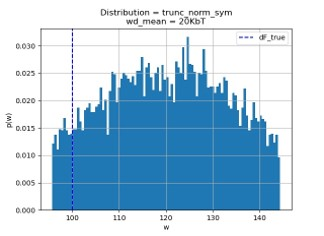
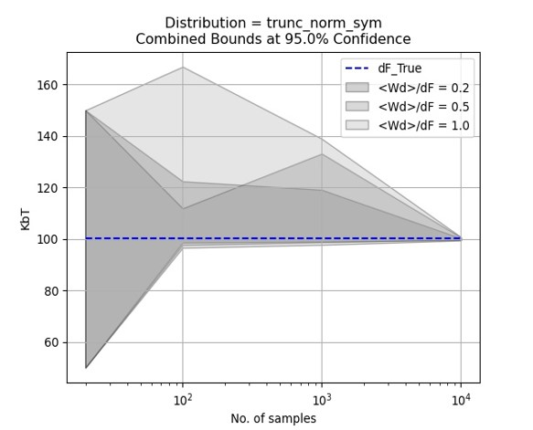
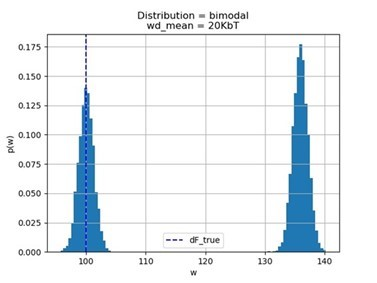
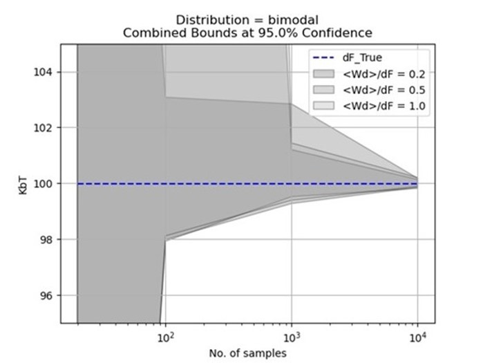
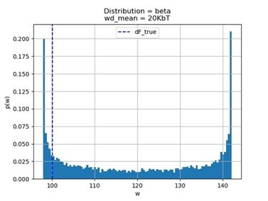
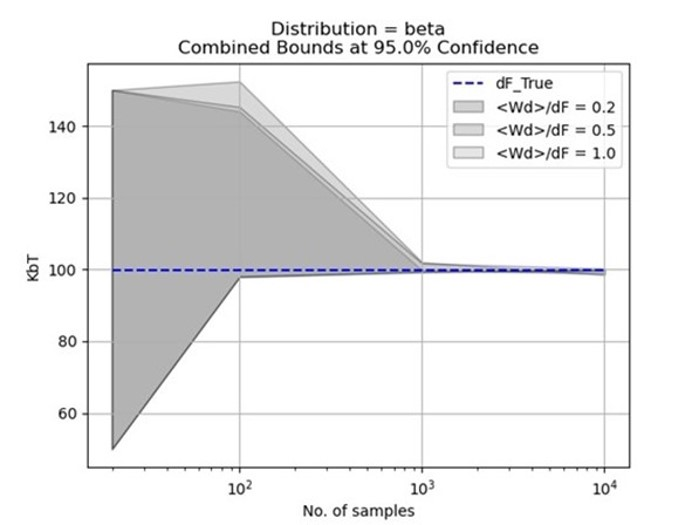

# Non-Equilibrium-Toolbox
A toolbox for computing confidence bounds on the free-energy estimates computed from non-equilibrium experiments via the Jarzynski equality. 

# How to use
Here is a sample code to compute the confidence bounds on the Jarzynski estimator in 5 easy steps:

```python
# STEP 1: Import toolbox
import sys
sys.path.append('../')

from APIs.NE_ErrorBnds.NE_Error_Bounds import NE_Error_Bounds
from APIs.Models.Random_Data_Generator import Random_Data_Generator

# STEP 2: Set experimental parameters & desired confidence levels 
T = 273 + 25 # Experimental temperature in Kelvin
conf_level = 95 # Confidence Level on the Bounds in Percentage

# STEP 3: Initialize the toolbox
RDGObj = Random_Data_Generator(T) 
NEBObj = NE_Error_Bounds(T)

# STEP 4: Generate work samples (replace STEP 4 with actual data)
N_samp = 1e3 # No. of work samples
wd_mean = 10 # Measured in KbT 
dF_true = 20 # Ground truth Free Energy Change in KbT
wd = RDGObj.get_wd_dist(wd_mean, N_samp) # Generating dissipation work distribution 
w = wd + dF_true # Finding the work distribution

# STEP 5: Compute bounds on dF & an estimate of dF
[dF_lower_bound, dF_upper_bound] = NEBObj.get_neq_error_bounds(w, conf_level) # Bounds

dF_estimate = NEBObj.get_Jarzynski_estimate(w) # dF estimate

```

# Examples
Here are examples of the bounds in action on different distributions of work:


<p float="left">
  
   
</p>

<p float="left">
  
   
</p>

<p float="left">
  
   
</p>


# Citation 
To cite this toolbox, please use:

- Rajaganapathy, Sivaraman, and Murti Salapaka. "Confidence bounds for the Jarzynski estimator." Bulletin of the American Physical Society (2022).
